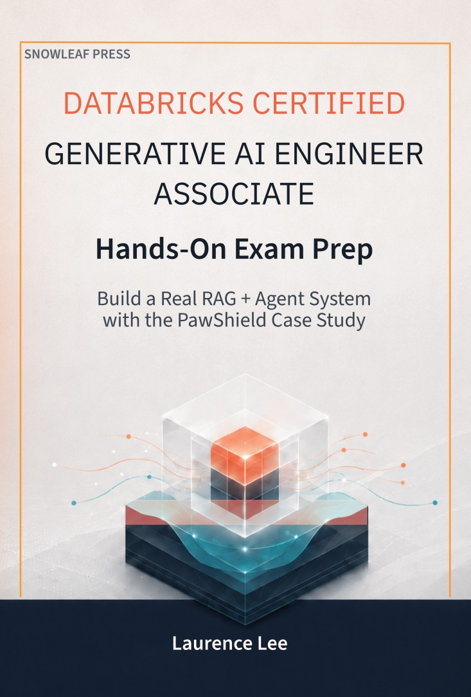

# Databricks Certified Generative AI Engineer Associate — Hands-On Companion

Data and runnable notebooks for **_Databricks Certified Generative AI Engineer Associate Hands-On Exam Prep_** (Laurence Lee, Snowleaf Press, 2026) — the lab side of the book that walks PawShield's RAG + agent system end-to-end on the same Databricks primitives the exam tests on.

---

## 📖 Companion to the book

This repo is the hands-on lab for **_Databricks Certified Generative AI Engineer Associate Hands-On Exam Prep_** — the textbook side of the same material.

<table>
  <tr>
    <td width="240" valign="top">
      <a href="https://mybook.to/dbx-genai-exam-prep">
        
      </a>
    </td>
    <td valign="top">
      <p>Read the concepts, then run them here. The book maps to every objective on the March 2026 blueprint — the central architectural patterns get worked PawShield examples readers can run end-to-end, and every objective has at least one quiz or mock scenario. This repo lets you execute, inspect, and break those examples in your own Databricks workspace.</p>
      <p>
        <a href="https://mybook.to/dbx-genai-exam-prep">
          
        </a>
      </p>
      <sub>Placeholder link — will be updated once the Amazon listing is live. The final link will auto-redirect to your local Amazon marketplace (US, UK, DE, FR, IT, ES, CA, AU, JP, IN, …).</sub>
    </td>
  </tr>
</table>

---

## What's in this repo

| Path | What |
|---|---|
| [`notebooks/`](notebooks/) | 12 chapter notebooks (Ch 0, 3–15) as Jupyter `.ipynb` with cell outputs preserved, plus 2 supporting Python modules |
| [`volume-bootstrap/`](volume-bootstrap/) | 877 fictitious PawShield files (30 policy PDFs, 50 vet invoices, 500 claim emails, 200 support transcripts, 40 marketing blogs, 50 adversarial inputs) + 7 parquet tables — fetched directly by the Ch 0 notebook; you do not need to download these manually |

The notebooks ship with cell outputs intact so you can **preview each chapter's runtime behaviour on GitHub before provisioning any Databricks resources** — figures, traces, dataframes, error messages all render in the GitHub UI.

## Quick start

**Nothing runs on your local machine.** Open a Databricks workspace and pick one of these two ways to bring in Chapter 0:

**Option A — Import the notebook URL.** In the Databricks UI: **Workspace → Create → Import**, choose **URL**, and paste:

```
https://raw.githubusercontent.com/snowleafbooks/databricks-genai/main/notebooks/00-setup/c0001-upload-to-databricks.ipynb
```

**Option B — Mount the whole repo as a Databricks Git folder.** **Workspace → Git folders → Create**, paste `https://github.com/snowleafbooks/databricks-genai`, and the entire `notebooks/` tree appears in your workspace.

Open `c0001-upload-to-databricks`, click **Run all**. The notebook downloads the bootstrap data from this repo, creates the catalog / schemas / Volume, stages the data, loads 7 Delta tables, and verifies Sarah Chen's lifecycle anchor. Default serverless does the whole thing in ~2–3 minutes.

If your workspace uses a catalog name other than `genaicert`, set the `catalog` widget before clicking Run all.

Full setup walkthrough: [INSTALL.md](INSTALL.md).

## What the data depicts

**PawShield** is a fictitious pet-insurance company used as the running case across the book. All names, IDs, dollar amounts, and claim records are fictitious; no real customer, vet practice, or claim is depicted. The "Sarah Chen" lifecycle thread (`CUST-CHEN-001`, claim `CLM-2026-03-00471`, $890 billed / $512 reimbursed) is the central worked example threading through every chapter.

## Repo conventions

- **Chapter notebook naming**: `cNNMM-<slug>.ipynb` — chapter `NN` ordinal `MM`. E.g. `c0301-extraction-prompt-iteration.ipynb` = Chapter 3, first notebook.
- **Companion `.py` modules** (`policypal_chain.py`, `policy_classifier_agent.py`) are imported by their chapter notebooks for code-based MLflow logging. They sit alongside the notebook they're imported from.

## Prerequisites

To actually **run** the notebooks (vs just reading them):

- A Databricks workspace with **Unity Catalog**, **Vector Search**, **Model Serving (with AI Gateway)**, and **Foundation Model APIs** (pay-per-token tier is enough for most chapters)
- Default **serverless compute** enabled (every notebook is serverless-compatible — no cluster creation required)
- Permission to create catalogs/schemas, or an admin to create `genaicert.pawshield` and grant you ownership

The book's Chapter 0 walks the setup end-to-end. If you only want to read along, no Databricks resources are needed — every notebook here renders with its outputs.

## License

[MIT](LICENSE) — code, data, notebooks. Copyright © 2026 Snowleaf Press.

## Errata & reader Q&A

See the [GitHub Issues](../../issues) on this repo. If a notebook fails or a code snippet is stale, please file an issue — corrections are folded into the next edition.
